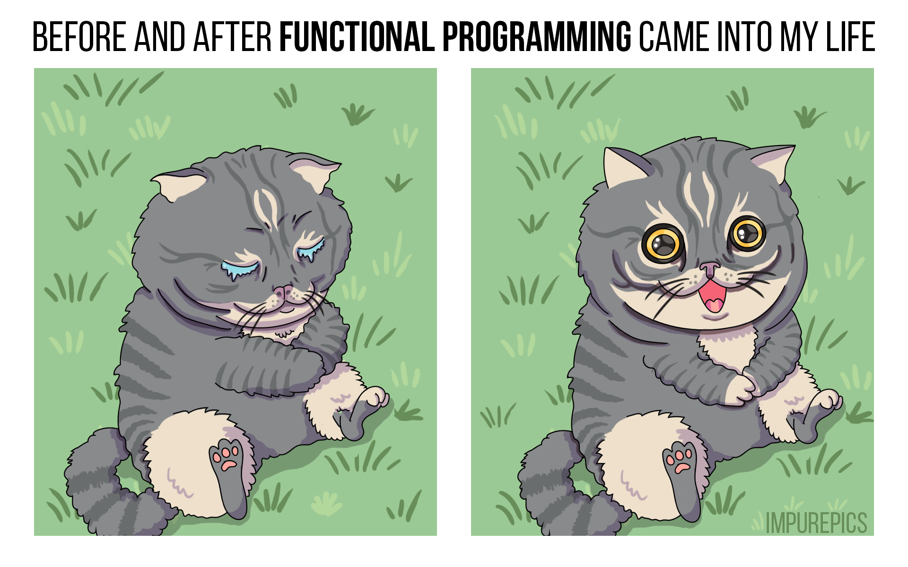
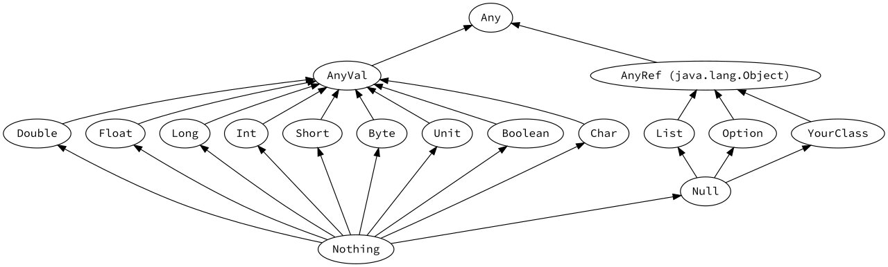

# Kodluyoruz Scala

## Mehmet Akif Tütüncü

* Scala since 2014
* Now: [Numbrs](https://numbrs.com)
* Before: [sahibinden.com](https://sahibinden.com), [VNGRS](https://vngrs.com), Linovi
* Contact: [akif.dev](https://akif.dev)

## 1. Functional Programming

* Programming with functions based on mathematical function model
  * Not imperative, we don't tell to do things
  * Declarative, we describe what to do and that description is interpereted/executed
  * <a href="https://impurepics.com/posts/2018-09-19-before-and-after.html"></a>
* Pure function
  * Output only depends on its input
  * No changes to external state
* Side effect
  * Modifying input or some state
  * Not necessarily producing a result
* Why FP?
  * Reasoning about code
  * Immutability - https://impurepics.com/posts/2020-05-28-how-to-change-lightbulb.html
  * Testing
* Referential transparency - inline all the things!
  * https://impurepics.com/posts/2018-04-01-referential-transparency.html

## 2. Scala Basics

### 2.1. Introduction

* Statically typed with a powerful type system
* Multiparadigm, best of both worlds, OOP + FP
* Runs on JVM, Java interop is possible
* Modern, concise, cool

### 2.2. Hello World

```scala
object Application {
  def main(args: Array[String]): Unit = {
    println("Hello world!")
  }
}
```

### 2.3. Values and Types

```scala
// A variable of type `String`
var variableMessage: String = "test"

// Can be reassigned
variableMessage = "test 2"

// No initial value (e.g. null), _ is used as a placeholder on definitions
var variable2: String = _

// A value (final variable)
val message: String = "hello"

// Cannot do this because val cannot be reassigned
message = "test"

// Cannot do because a value it won't be assigned in the future, needs to be assigned now
val value: String = _

// Type can be inferred, (mostly) no need to provide it explicitly in the definition

val number    = 42         // Type is `Int`
val isEnabled = false      // Type is `Boolean`
val timestamp = 123456789L // Type is `Long`
val separator = '-'        // Type is `Char`
val average   = 123.45     // Type is `Double`

// A method taking 3 parameters and returning `String`
// `z` has a default value (like overloading)
def explain(x: String, y: Int, z: Boolean = false): String = {
  // String interpolation
  s"X = $x, Y = $y, Z = $z"
}

println(explain("hello", 5, true))

// Named arguments, notice `z` is not provided so default value will be used
println(explain(x = "hello", 5))

// Since arguments can be named, order may change
println(explain(y = 42, z = true, x = "test"))

// Method return types can also be inferred
// If method body is a single expression, {} are not needed
def add(a: Int, b: Int) = a + b

// Methods can have multiple parameter groups
def someWeirdMethod(x: String, y: Int)(z: Boolean): Char = ???

// They can also have 0 parameters
def hello = "hello"
```

<a href="https://docs.scala-lang.org/tour/unified-types.html"></a>

### 2.4. Conditions and Loops

```scala
val score = 42

// if/else if/else block as an expression (produces value)
val state =
  if (score < 33) {
    "Low"
  } else if (score < 66) {
    "Average"
  } else {
    "High"
  }

// match expression (similar but more powerful than switch, more on that later)
val message =
  state match {
    case "Low"     => "Try again"
    case "Average" => "OK"
    case _         => "Congratulations" // default branch
  }

// while loop with a variable that changes loop condition
var i = 1
while (i <= 10) {
  println(i)
  i += 1
}

// Iterating over [1, 5] range (index based for loop)
for (i <- 1 to 5) println(i)

// Iterating over [6, 11) range
for (j <- 6 until 11) {
  println(j)
}

// Multi dimentional, stepped and conditioned for
for {
  i <- 1 to 20 by 2           // i = 1, 3, 5, ...
  j <- i to (i * 2) if j < 14 // j won't be >= 14, loop will terminate
} {
  print("[" + i + ", " + j + "] ")
}

// for also can be an expression via `yield`, otherwise for returns `Unit`
val doubles = (for (i <- 1 to 3) yield i * 2).toList // List(2, 4, 6)
```

### 2.5. Standard Library and Data Structures

#### 2.5.1. Functions

```scala
// `Int => Int` is the type of the function, sugar for `Function1[Int, Int]`
// `number` is inferred to be of `Int` in the lambda
// `double` is called a function literal
val double: Int => Int = number => number * 2

// Name can be omitted in simole cases
val half: Int => Int = _ / 2

// `(Int, Int) => String` is inferred
val describe = { (number1: Int, number2: Int) =>
  val doubled = double(number1) // invocation is like method call
  val halved  = half(number2)
  
  // Triple quoted String literal
  // Great for multiline, great for using quotations without escaping
  // Can define margin and strip it later for easier formatting
  s"""
     |For "$number1":
     |  Double: $doubled
     |  Half  : $halved
     |""".stripMargin
}

for (i <- 1 to 5) {
  println(describe(i, i))
}
```

#### 2.5.2. Array, List, Set, Map

```scala
// Array construction, `Array[Int]` is inferred
val numbers = Array(1, 2, 3)

// Access an index
println(numbers(1))

// Update an index
numbers(0) = 2
numbers.update(2, 5)

// Classic foreach-style loop
for (i <- numbers) {
  println(i)
}

// Functional way of side-effecting loop
// Here, `foreach` takes a `Int => Unit`
// Using the value, not producing result, hence the side effect
numbers.foreach { i =>
  println(i)
}
```

```scala
// List construction, `List[Int]` is inferred
val scores = List(37, 83)

// `head :: tail` style list construction, ends with `Nil` (empty List)
val names = "Mehmet" :: "Akif" :: Nil

// Prepending via `+:` and getting a new list, List is immutable
val moreNames = "Ali" +: names

// Appending via `:+`, addition happens where `+` is
val evenMoreNames = moreNames :+ "Veli"

// Apply some operations, like a pipeline and get new values
val someUpperCaseNames = evenMoreNames.filter(_.length > 3).map(_.toUpperCase)

// Access via application (`apply` method)
println(someUpperCaseNames(0))

// Pattern matching against a List
someUpperCaseNames match {
  case "MEHMET" :: nextName :: _ =>
    // Matching first element to a literal
    // Matching second to a named value, `nextName` is inferred as `String`
    // Ignoring tail via `_`
    println(s"First name was MEHMET and the next is $nextName")
  
  case _ =>
    println("Pattern did not match")
}

// Folding starts with a value, uses that value and current item while iterating over
// For a `List[A]`, signature is `foldLeft(b: B)(f: A => B): B`
val string =
  (1 to 5).toList
          // List[Int]
          .zipWithIndex
          // List[(Int, Int)]
          .map { case (number, index) => s"$index: $number" }
          // List[String]
          .foldLeft("") { case (result, value) => result + s"$value, " }
          // String
```

```scala
// Set creation, `Set[String]` is inferred
val initialWords = Set("hello", "world")

val newWords = "Damn! World failed."
  .replaceAll("[^\\w]", " ") // Replace anything not a letter with space
  .split(" ")                // Split from spaces into an Array
  .filterNot(_.isEmpty)      // Remove empty Strings
  .map(_.toLowerCase)        // Lowercase words
  .toSet                     // Convert the Array to a Set

// Set union, won't add "world" again
val allWords = initialWords ++ newWords

if (allWords.contains("damn")) {
  println("Watch your language!")
}
```

```scala
// Map creation, `Map[Char, Int]` is inferred
val romanNumerals = Map(
  'I' -> 1, // Syntax sugar for `Tuple2`
  'V' -> 5,
  'X' -> 10,
  'L' -> 50,
  'C' -> 100,
  'D' -> 500,
  'M' -> 1000
)

def convert(romanNumeralType: Char): Int =
  if (!romanNumerals.contains(romanNumeralType)) {
    -1
  } else {
    // Access directly by key (via `apply`)
    // Use with caution. If key doesn't exist, it will throw an exception.
    romanNumerals(romanNumeralType)
  }

println(s"X: ${convert('X')}")
println(s"A: ${convert('A')}")
```

#### 2.5.3. Option

```scala
// `Option[Int]` is inferred as return type
def divide(a: Int, b: Int) = if (b == 0) None else Some(a / b)

val division1 = divide(4, 2) // Some(2)
val division2 = divide(5, 0) // None

// `Option.apply` is smart against nulls, `Some` is not smart (`Some(null)` is possible)
val maybeUserName = Option(SomeJavaClass.getNullableUserName)

// Can be pattern matched
division2 match {
  case Some(result) => println(result)
  case None         => println("Cannot divide by 0")
}

// For comprehension, will print and be `Some(15)`
val calculation1 =
  for {
    res1 <- divide(9, 1)
    res2 <- divide(8, 2)
    res3 <- divide(7, 3)
  } yield {
    println("Yielding result")
    res1 + res2 + res3
  }

// Won't print and be `None`
val calculation2 =
  for {
    res1 <- divide(6, 4)
    res2 <- divide(5, 0)
  } yield {
    println("Results: $res1, $res2")
    res1 + res2
  }

// This is what happens behind the scenes of `calculation1`
val calculation3 =
  divide(9, 1).flatMap { res1 =>    // Values are flatmapped
    divide(8, 2).flatMap { res2 =>
      divide(7, 3).map { res3 =>    // Last value is mapped
        println("Yielding result")
        res1 + res2 + res3
      }
    }
  }

val result1 = calculation1.get // 15
val result2 = calculation2.get // NoSuchElementException: None.get

val result3 = calculation2.getOrElse(0) // 0

val message =
  calculation2.orElse(calculation1)     // Provide alternative `Option[Int]`
              .filter(_ > 10)           // Will be `None` if predicate fails against value
              .fold("No result") { i => // `def fold(default: B)(use: A => B): B`
    s"Result = $i"
}
```

#### 2.5.4. Either

```scala
val errorOrValue1: Either[String, Double] = Left("no value")
val errorOrValue2: Either[Exception, Int] = Right(42)

val error1 = errorOrValue1.swap.toOption // Some("no value") as `Option[String]`
val error2 = errorOrValue2.left.toOption // None             as `Option[Exception]`

// `Either` is right-biased, if Left, default value will be returned
val value1 = errorOrValue1.getOrElse(0) // 0 as `Double`
val value2 = errorOrValue2.getOrElse(0) // 42 as `Int`

// Can be pattern matched
errorOrValue1 match {
  case Left(error)  => println(s"Error: $error")
  case Right(value) => println(s"Value: $value")
}

// Need to indicate types of both sides for type inference to infer correct types
// Otherwise `Right(3)` would be inferred as `Right[Any, Int]`
// Result will be `Right("hello 3")` as `Either[String, String]`
val maybeMessage =
  for {
    number  <- Right[String, Int](3)
    message <- Right[String, String]("hello")
  } yield s"$message $number"

// `Left(false)` as `Either[Boolean, Int]`
val maybeMultiplication =
  for {
    a <- Left[Boolean, Double](false)
    b <- Right[Boolean, Int](5)
  } yield a * b
```

#### 2.5.5. Try

```scala
import scala.util.{Try, Success, Failure} // multiple imports from same package

def firstUnsafe(list: List[Int]): Int = list.head

val first1 = firstUnsafe(List.empty) // NoSuchElementException: head of empty list

val first2 =
  try {
    firstUnsafe(List.empty)
  } catch {
    // catch part is also a pattern matching
    case e: IllegalArgumentException => println(e); -1 // Semicolon if you really need
    case _: NoSuchElementException   => -2
    case e =>
      e.printStackTrace()
      -3
  }

// `Try.apply` is the functional way of wrapping things in try-catch
def first(list: List[Int]): Try[Int] = Try { list.head }

val first3 = first(List.empty)    // Failure(...)
val first4 = first(List(1, 2, 3)) // Success(1)

println(first3.get)           // Will throw the caught exception
println(first3.getOrElse(-1)) // -1

println(first4.get) // 1

// Recover with a value if given partial function matches
// Success(-1)
val first5 = first3.recover {
  case e if e.getMessage.contains("empty") =>
    -1
}

// Recover with another Try if given partial function matches
// Failure(Exception(NoSuchElementException(...)))
val first6 = first3.recoverWith {
  case e: IllegalArgumentException => Success(-1)
  case e                           => Failure(new Exception(e))
}
```

### 2.6. Structures

#### 2.6.1. Class

```scala
// Primary constructor in the definition, concise syntax
class Player(val name: String, var score: Int, isNoob: Boolean = true) {
  // `override` is a keyword, not an annotation
  override def equals(obj: Any): Boolean =
    obj match {
      // Matches on the type, not the value itself, value is bound to name `that`
      case that: Player =>
        // `==` is `equals` so Strings are also compared using `==`
        this.name == that.name && this.score == that.score
      
      case _ => false
    }
  
  override def hashCode(): Int =
    17 * name.hashCode() * score
  
  def copy(newName: String = name, newScore: Int = score): Player =
    new Player(newName, newScore)
  
  override def toString(): String =
    s"Player($name, $score)"
}

// Instance creation via `new`
val player = new Player("Akif", 0)

// `score` is a field, therefore can be accessed (and be modified since it's var)
player.score += 10

// This won't work here (outside the class)
// `isNoob` is only a constructor parameter, not a field
println(player.isNoob)

println(player.copy(newName = "Mehmet Akif"))
```

##### 2.6.1.1. Case Class

```scala
// Immutable, therefore `val` fields by default
// Generates all the boilerplate for you
case class Player(name: String, score: Int = 0)

// No need for `new` because generated `apply` is called as `Player.apply(...)`
val player = Player("Akif")

// Generated `copy` to get a copied instance with certain things modified
val playerWithHigherScore = player.copy(score = player.score + 10)

// Generated `toString`
println(playerWithHigherScore)

// Also `equals`, `hashCode` and more are generated
```

#### 2.6.2. Object

```scala
// Out-of-the-box singleton
object Utilities {
  val pi = 3.141592653589793
  
  def areaOfCircle(radius: Double): Double = pi * radius * radius
}
```

##### 2.6.2.1. Companion Object

```scala
class Cake(val layers: Int) {
  val description: String = s"$layers layered cake"
  
  def celebrate(): Unit = Cake.celebrateWith(this)
}

// Companion object to `Cake` using same name, otherwise a regular object
object Cake {
  // Acts as a constructor, can be overloaded
  def apply(layers: Int): Cake = new Cake(layers)
  
  def celebrateWith(cake: Cake): Unit =
    println(s"I'm having a ${cake.description} for celebration.")
}

val fruitCake     = new Cake(2) // Regular instance creation
val chocolateCake = Cake(3)     // Short for `Cake.apply(3)`

// Instance method
chocolateCake.celebrate()

// Accessed statically on the object
Cake.celebrateWith(fruitCake)
```

#### 2.6.3. Abstract Class and Trait

```scala
// Can have primary constructor like a regular class
// Can be extended only once via `extends`
abstract class Pide() {
  def eat(): Unit
}

// Interface on steroids, cannot have a constructor (yet)
trait Meaty {
  val meat: String
}

trait Cheesy {
  val cheese: String
}

// First extend via `extends`, then mix-in via `with`
case class CheesyMeatPide(override val meat: String,
                          override val cheese: String) extends Pide() with Meaty with Cheesy {
  val name: String = s"$meat pide with $cheese cheese"
  
  override def eat(): Unit = println(s"Eating $name")
}

object VegetarianPide extends Pide() with Cheesy {
  override val cheese: String = "white"
  
  override def eat(): Unit = println(s"I don't eat meat so I'm eating $cheese cheese pide")
}

CheesyMeatPide("ground beef", "white cheddar").eat()

VegetarianPide.eat()
```

#### 2.6.4. Enumerations

```scala
// Standard Scala enumeration (not the recommended way)
// It will contain an inner `Value` type.
object Color extends Enumeration {
  // This weird thing generates `Value` instances
  // for these values during compilation
  val Red, Green, Blue = Value
}

println(Color.values)            // Color.ValueSet(Red, Green, Blue)
println(Color.Blue.id)           // 2
println(Color.withName("Green")) // Green

object RGB extends Enumeration {
  // You can extend `Value` to add more fields to each item
  case class Val(override val id: Int, code: Char) extends Value

  // We instantiate them ourselves in this case.
  val Red   = Val(0, 'r')
  val Green = Val(1, 'g')
  val Blue  = Val(2, 'b')
}

println(Color.Blue.code) // b

def describe(color: RGB.Val): String =
  color match {
    case RGB.Red  => "red"
    case RGB.Blue => "blue"
  }

// This will fail with `MatchError` in runtime!
println(describe(RGB.Green))
```

```scala
// Sealed means `Color` cannot be extended outside this file.
// In other words, all possible subtypes of this type is known.
// It will also help compiler in exhaustivity checks of pattern matches.
sealed trait Color

object Color {
  // Regular inheritance, need single instances so they are `object`s
  // We want to benefit from generated methods so we also use `case`
  case object Red   extends Color
  case object Green extends Color
  case object Blue  extends Color

  // This is optional but it's a good idea to have it avaliable
  val values: List[Color] = List(Red, Green, Blue)
}

// Custom type for enum items
sealed abstract class Auth(val anonymous: Boolean)

object Auth {
  // Can have multiple instances since it's a regular class
  case class  UserPass(user: String, pass: String) extends Auth(false)
  case class  Token(token: String)                 extends Auth(false)
  case object Guest                                extends Auth(true)
}

def getSecret(credentials: Auth): Either[String, Int] =
  credentials match {
    // Match to a pattern and add conditions if needed
    case Auth.UserPass("admin", pass) if pass != "@dM1n" =>
      Left("Incorrect username/password")

    case Auth.Token("1234abc") =>
      Left("Expired token")

    // Can match against type and give name to value of that type
    case a: Guest =>
    	Left("Need authorization")

    // Can destruct and match against fields (and ignore some)
    // Also give a name the matched pattern via `@`
    // Here `a` is of `Auth.UserPass` type, not just `Auth`
    case a @ Auth.UserPass(user, _) =>
      println(s"Accessing secret as $user")
      Right(42)

    // Can match against type and not care about name of the value
    case _: Auth.Token =>
      println(s"Accessing secret as an API with token")
      Right(42)
    
    // If this pattern match did not cover all cases (not exhaustive),
    // compiler will warn because `Auth` is a sealed type.
    // In such a case, add `case _ =>` or handle all possible cases.
  }

// Left(Need authorization)
println(getSecret(Auth.Guest))

// Left(Expired token)
println(getSecret(Auth.Token("1234abc")))

// Right(42)
println(getSecret(Auth.Token("test")))

// Right(Incorrect username/password)
println(getSecret(Auth.UserPass("admin", "admin")))

// Right(42)
println(getSecret(Auth.UserPass("admin", "@dM1n")))
```

## 3. More on Scala

### 3.1. Generics

```scala
// `I` is called a type parameter of `Model`
trait Model[I] {
  val id: I
}

abstract class Message[M] {
  val content: M
}

case class TextMessage(override val id: Int,
                       override val content: String) extends Message[String]
                                                        with Model[Int]

case object UnitModel extends Model[Unit] {
  override val id: Unit = ()
}

// `M` has a constraint, `M` must be a subtype of `Model[I]`
// Subtype relation is denoted with `<:`
// There is also its counterpart supertype constaint `>:`
def idOf[M <: Model[Int]](model: M): Int = model.id

val message = TextMessage(1, "Hello")

// Method type parameter is inferred from parameter
println(idOf(message)) // 1

// Will not work because `UnitModel` is not a `Model[Int]`
idOf(UnitModel)
```

### 3.2. Higher Order Functions, Currying, Partially Applied Functions

```scala
// Example from: https://docs.scala-lang.org/tour/higher-order-functions.html

// Method returns a function
def urlBuilder(secure: Boolean, domain: String): (String, String) => String = {
  val schema = if (secure) "https://" else "http://"
  
  // Function to be returned
  (path: String, query: String) => s"$schema$domain/$path?$query"
}

// Function literal of type `(String, String) => String`
val getUrl = urlBuilder(secure = true, "google.com")

// https://google.com/search?q=scala
val url = getUrl("search", "q=scala")
```

```scala
def convert(int: Int): String = int.toString

// Becomes a function literal of type `Int => String` when argument is not given
// Also called partially applied function
val converter = convert _

// `fold` has 2 parameter groups, it's also called a curried function
// Think of each parameter group as the input of next parameter group
//
// So type of `fold` is
// `(List[A], B) => ((B, A) => B) => B`
//
// When first parameter group is given it becomes
// `((B, A) => B) => B`
//
// When second parameter group is given it becomes
// `B`
def fold[A, B](list: List[A], initial: B)(operation: (B, A) => B): B = {
  var result: B = initial
  for (a <- list) {
    result = operation(result, a)
  }
  result
}

// A function literal
val appender: (String, Int) => String = (s, i) => s + i.toString

// Second parameter group of `fold` is not given
// So it becomes a function literal, requiring the value of first parameter group as an input
val looper: ((String, Int) => String) => String = fold((1 to 5).toList, "")

// Apply the missing parameter (which is another function)
println(looper(appender))

// Notice second parameter group is written with {} as it is a function
// Type parameters of `fold` are both inferred to be `Int` here
println(fold((1 to 5).toList, 0) { (result, int) => result + int }) // 15
```

### 3.3. More on Collections

```scala
// TODO
```

### 3.4. Implicits

```scala
// TODO
```

### 3.5 Future

```scala
// TODO
```

### 3.6. Concurrency

```scala
// TODO
```

### 3.7. Laziness

```scala
// TODO
```

### 3.8. Typeclasses

```scala
// TODO
```

